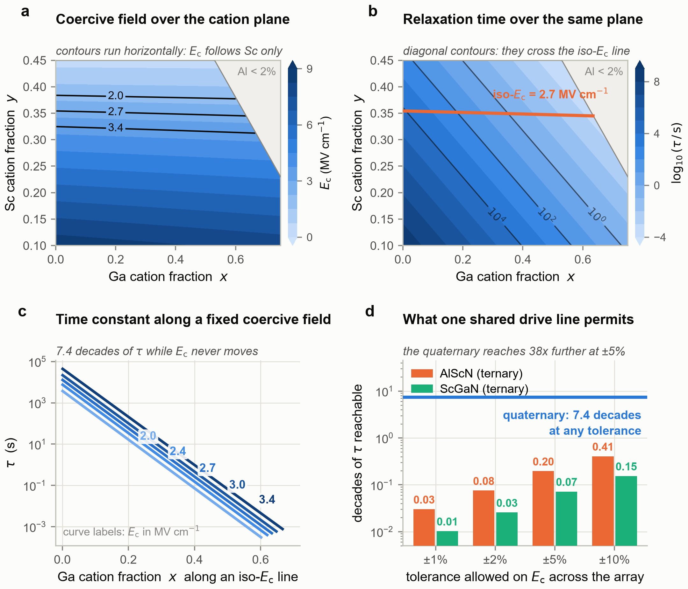
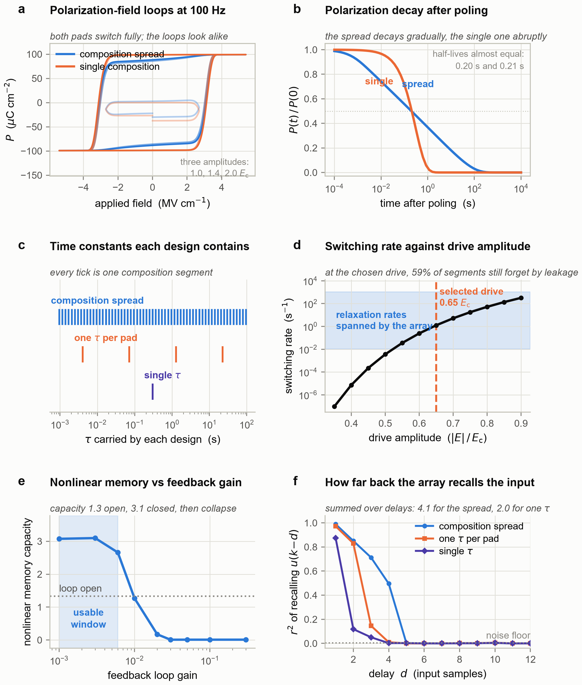
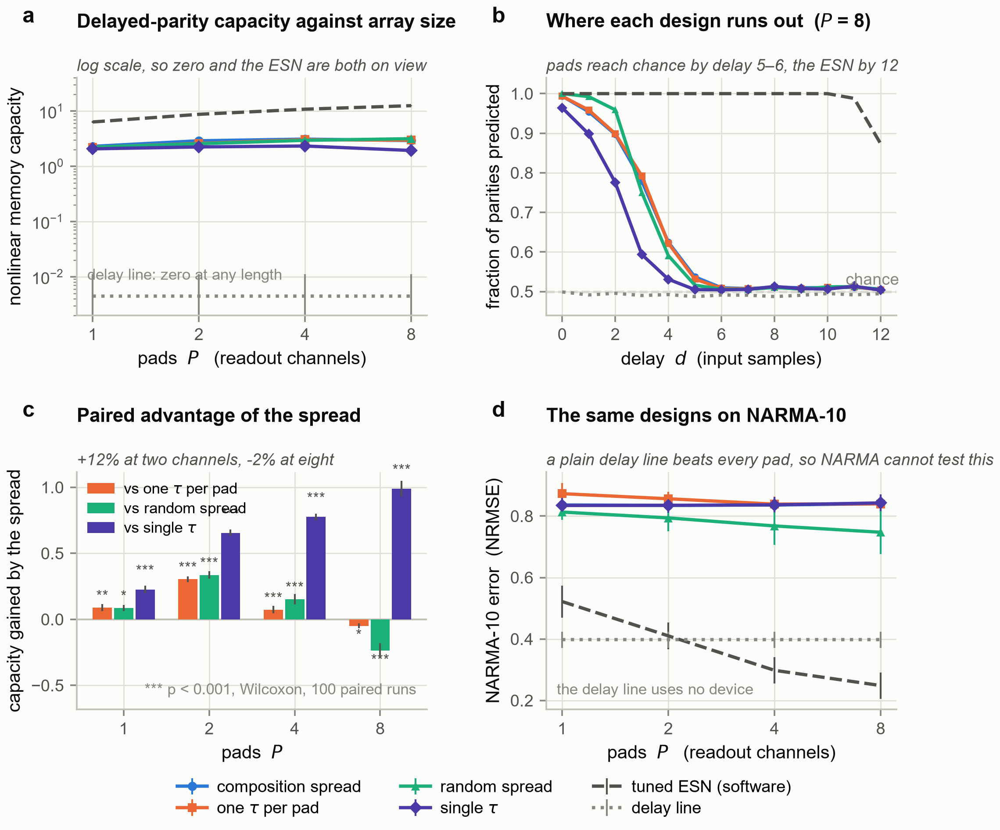
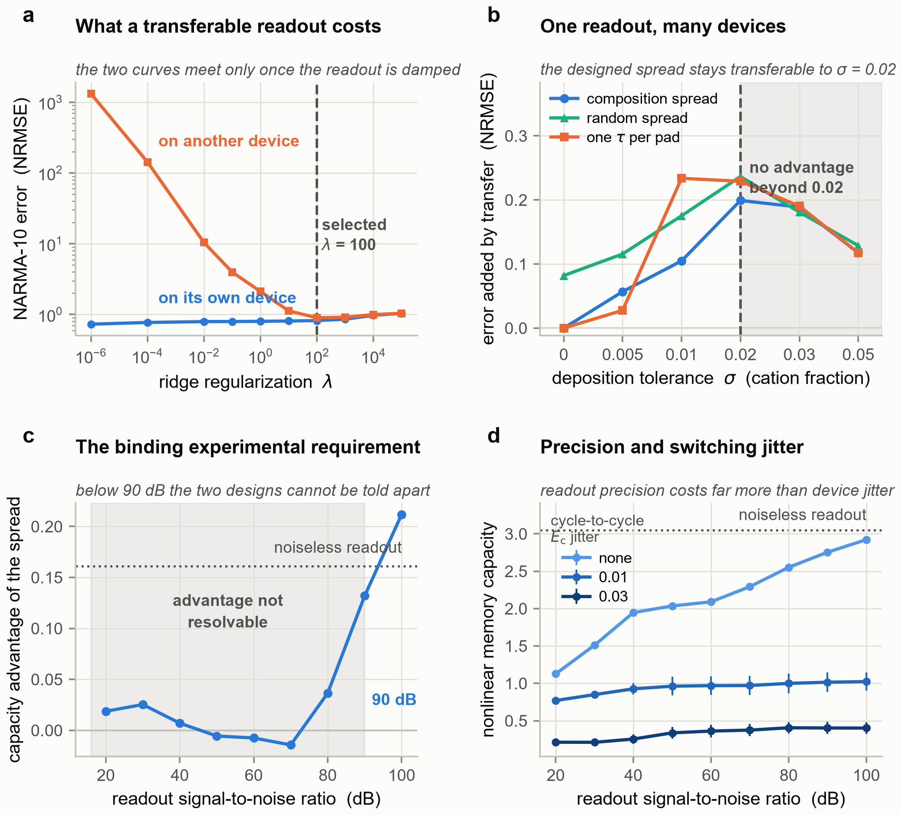
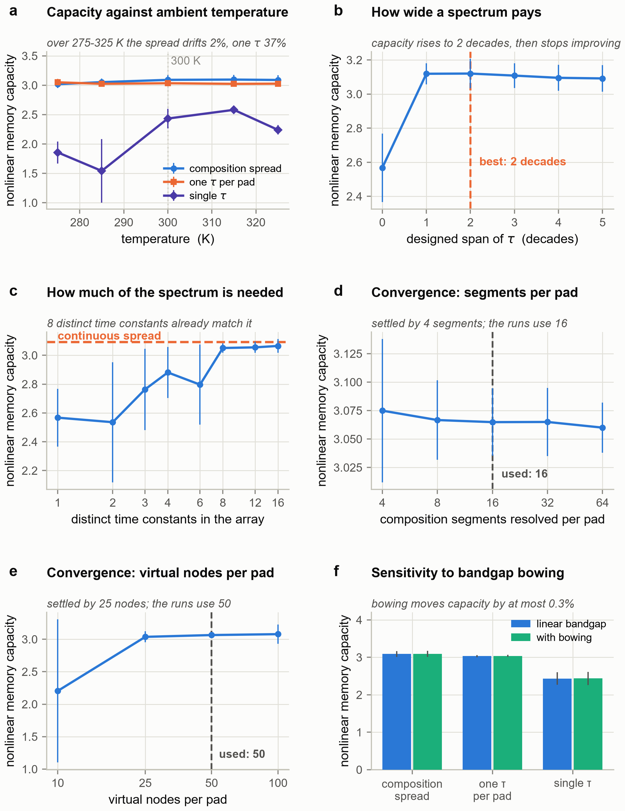
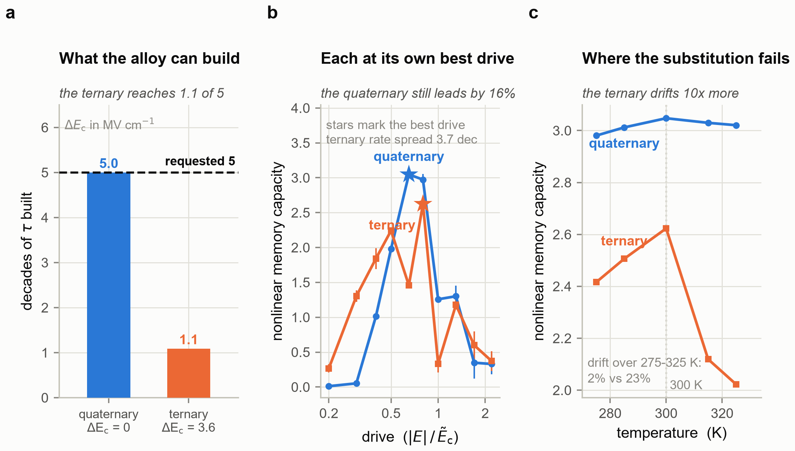

# Decoupling coercive field from relaxation time in wurtzite Al–Sc–Ga–N: a designed time-constant spectrum for in-materio computing, and the limits of what it computes

*[Author]¹, [Author]²*

*¹ [Affiliation]  ² [Affiliation]*

**This is a modelling study. No film was grown and no device was measured. The
material model is phenomenological; two of its four calibration anchors are
stated design targets rather than measurements.**

## Abstract

In-materio reservoirs draw their computational richness from a broad
distribution of relaxation times, which in disordered nanomaterial networks
arises from stochastic self-assembly and is therefore irreproducible.
Crystalline alternatives restore reproducibility but deliver one time constant
at a time. We show that designing the distribution instead of inheriting it
carries a sharper requirement than it appears: the elements of an array must
also switch at the same field, or they cannot share a drive line. Wurtzite
quaternary Al(1−x−y)Ga(x)Sc(y)N supplies the two composition axes this needs,
Sc setting the coercive field and the Al:Ga ratio setting the bandgap and
hence the leakage that governs depolarization. On an iso-coercive-field
trajectory the alloy spans 7.43 decades of relaxation time at exactly constant
switching threshold; inside a ±5% coercive-field tolerance the ternary parents
reach only 0.196 and 0.072 decades. Simulating a composition-spread pad array
as a delay-based reservoir, the designed spectrum raises nonlinear memory
capacity over one time constant per pad by 11.7% at two readout channels,
narrowing at four and reversing at eight — a scarce-channel advantage. A
matched software reservoir still reaches three to four times the capacity. Two
controls proved decisive: a plain delay line beats the device on NARMA-10, so
delayed parity is used instead; and driven open-loop the pad is a Hammerstein
system whose nonlinear memory is perfect at zero delay and gone by the fourth,
until a delayed-feedback loop is closed. With perfect fabrication the designed
spread transfers a trained readout between devices at zero cost where a random
spread of identical statistics incurs a penalty of 0.088; the advantage
survives to ±1 at% deposition tolerance. Two requirements emerged that we did
not anticipate: the readout must resolve about 90 dB, and the wide spectrum
earns its width through temperature robustness rather than peak capacity.

**Keywords:** wurtzite ferroelectrics, AlScN, ScGaN, physical reservoir
computing, in-materio computing, composition spread, combinatorial synthesis

---

# Introduction

Physical reservoir computing exploits the dynamics a material already has. An
input drives a physical system, the system's own relaxation supplies fading
memory and its own nonlinearity supplies the expansion, and only a linear
readout is trained [1]. The appeal is that the expensive part of a recurrent
network — the recurrent dynamics — costs nothing to run, because the physics
runs it.

What makes a material good at this is not a single relaxation time but a broad
distribution of them. A reservoir with one time constant is a single low-pass
filter; a reservoir carrying many, spread over decades, can hold the recent
past and the distant past at once, and a linear readout can then select the
timescale each task needs. This is why disordered nanomaterial networks work
so well [6-8]. In Ag/Ag₂S nanoparticle assemblies the spread of junction sizes
produces a spread of ionic diffusion rates, and it is precisely that
heterogeneity that supplies the computational richness [6, 7].

The same mechanism is also the field's central obstacle. The distribution
arises from stochastic self-assembly, so no two networks are alike. Device-to
-device reproducibility is out of reach, a readout trained on one sample is
worthless on the next, and manufacturing is therefore not on the table. The
usual response has been to move to crystalline materials and tune the
relaxation time extrinsically — with bias, illumination, or ferroelectric
polarization state. That restores reproducibility but gives up the thing that
made the disordered networks work: those knobs deliver one time constant at a
time, not a simultaneous spectrum.

We ask whether a spectrum can be *designed* rather than *inherited*. The
requirement is sharper than it first appears. It is not enough to find a
material whose relaxation time varies with composition; almost any alloy does
that. The elements of an array must also switch at the same field, or they
cannot share a drive line, and an array whose elements each need their own
drive voltage is not a reservoir but a collection of separately addressed
devices. The real requirement is therefore a material in which the relaxation
time can be moved over decades *while the coercive field stays put*.

Wurtzite quaternary Al(1−x−y)Ga(x)Sc(y)N offers exactly the two independent
axes this needs. Scandium content sets the coercive field [9, 11], because
switching nucleates in Sc-bearing unit cells; the Al:Ga ratio sets the
bandgap, and through it the leakage that drives depolarization, and so the
relaxation time. A combinatorial co-sputtered wafer with a lateral composition
gradient can therefore carry a designed distribution of time constants at a
single coercive field; combinatorial gradient deposition is already
established for AlScN [16] and, in the quaternary AlScBN, across 850 samples
of a single phase space [17]. Ferroelectricity has been demonstrated in
sputtered ScGaN [10, 11] and, as a quaternary, in MBE-grown Sc-Al-Ga-N [13];
what has not been examined is what the second composition axis is worth as a
design variable. Neither ternary can: with one composition axis, moving the
relaxation time necessarily drags the coercive field with it.

This paper makes that argument quantitative and then tests it honestly. We
first map the composition design space and show what the decoupling is worth,
measured the way a device engineer would measure it — decades of relaxation
time available inside a given coercive-field tolerance. We then simulate the
resulting pad array as a delay-based reservoir and ask what it computes.

The second half of the paper is as much about controls as about results,
because the controls turned out to change the conclusions. Three of them
deserve stating up front.

First, NARMA-10, the field's most-used benchmark, cannot carry this argument.
Its target is dominated by a linear function of the input history, so a plain
delay line — ridge regression on the raw inputs, no device at all — beats the
device on it. Selecting an operating point by NARMA error also drives the
input modulation toward zero, switching the device's nonlinearity off. We
report NARMA-10 beside that control rather than omitting the task, and use
delayed parity as the primary metric instead: no linear filter of the input
can exceed chance on it at any delay, unlike NARMA-10 [5], so a score above
chance is direct evidence that the device is computing rather than storing.

Second, driven open-loop the pad is not a reservoir at all. It is a
Hammerstein system — an instantaneous nonlinearity followed by a bank of
linear filters — and although it solves zero-delay parity perfectly, what it
retains at longer delays is weak and gone by the fourth. We show why this follows from the structure of
the switching equation, and that a delayed-feedback loop, which is one charge
amplifier summed into the drive, is what makes the dynamics recurrent [2]. The
usable loop gain spans about three quarters of a decade.

Third, the readout is severely ill-conditioned: the array produces far more
state columns than independent dynamical directions. Choosing the
regularization for single-device accuracy alone yields weights that are exact
on the device they were fitted to and meaningless on any other, so
cross-device transfer must be studied as a function of regularization or the
metric reports conditioning rather than reproducibility.

None of these three is specific to nitride ferroelectrics, and we suspect the
first two apply to a good deal of the physical-reservoir literature.

What we claim, in the end, is bounded and we state the bounds plainly. The
materials result stands on its own: the quaternary buys orders of magnitude
more usable time-constant range at fixed coercive field than any ternary, and
that is a design rule for anyone building an array of nitride ferroelectric
elements. The computational result is real but modest: the designed spectrum
measurably raises nonlinear memory over one time constant per pad at matched
readout channels, and the deterministic spread matches a random one in
performance while beating it in device-to-device reproducibility, which was
the point. We do not claim to approach a tuned software reservoir; a matched
echo state network [3] reaches three to four times the nonlinear memory capacity,
and the case for the device is energy and area at the sensor, not accuracy
parity. Finally, everything here is simulated, from a phenomenological model
whose calibration anchors we state individually, and the experiment that would
test it is described in the discussion together with the measurement precision
it would require.

---

# Methods

All results in this work are simulated. No film was grown and no device was
measured. The material model is phenomenological and calibrated to published
coercive-field measurements; the two retention anchors are stated design
targets rather than measurements, and are identified as such below. Unless a
temperature sweep is stated explicitly, every reported result is at an ambient
of 300 K. The complete simulation package, including every script that produced
a figure, is available at [repository].

## 1. Composition–property model

We model wurtzite Al(1−x−y)Ga(x)Sc(y)N through four maps of the cation
fractions x (Ga) and y (Sc), with the Al fraction 1 − x − y constrained to
stay above 0.02.

**Bandgap.** The main results use the linear virtual-crystal approximation,

  Eg(x, y) = (1 − x − y)·E_AlN + x·E_GaN + y·E_ScN,

with E_AlN = 6.2 eV, E_GaN = 3.43 eV and an effective E_ScN = 2.0 eV. Bowing
is neglected here and its effect is reported as a sensitivity analysis using
pairwise bowing parameters (b_AlGa, b_AlSc, b_GaSc) = (0.9, 4.2, 3.0) eV. The
AlGa value sits within the range reported for wurtzite AlGaN in the standard
compilation [21] and in dedicated measurements on the alloy [32]; the two
Sc-pair values are estimates, since no comparable compilation exists for them.
The neglect is not free. AlGaN bowing alone is of order 0.9 eV, so absolute
compositions carry errors of a few hundred meV of gap; the Sc-containing pairs
are more strongly nonlinear still, which is why the two Sc bowing parameters
used in the sensitivity run are larger than the AlGa value and are estimates
rather than recommended constants. What survives the approximation is the
design rule — a monotone iso-Ec trajectory spanning more than seven decades of
relaxation time — and not the particular composition that realises a given time
constant. Composition values quoted anywhere in this work should be read in
that light.

**Coercive field.** Switching in Sc-containing wurtzites nucleates in
Sc-bearing unit cells, so Ec is taken to be governed by the Sc fraction with a
weak Ga softening term,

  Ec(x, y) = [E0 + S·(y − y0)]·(1 − g·x),  g = 0.12.

E0 and S are fixed by two literature anchors: Ec = 4.7 MV cm⁻¹ for sputtered
Al(0.73)Sc(0.27)N [9] and Ec = 1.5 MV cm⁻¹ for sputtered
Sc(0.40)Ga(0.60)N [11, 12], the lowest coercive field reported for any
wurtzite ferroelectric. This gives E0 = 4.70 MV cm⁻¹ and S = −23.7 MV cm⁻¹ per
unit Sc fraction. Unlike the retention anchors below, both are measured values
and are cited as such.

Because Ec depends on both cation fractions, the locus Ec(x, y) = Ec* can be
inverted analytically for y(x); we call this the iso-Ec trajectory and every
device in this work lies on one.

**Retention time constant.** Depolarization is leakage-mediated, and the
leakage barrier is taken proportional to the alloy bandgap in the manner of a
Poole–Frenkel process, which is the dominant leakage mechanism identified in
Al0.7Sc0.3N itself, attributed there to positively charged nitrogen vacancies
[29], and in Al-rich AlGaN [23],

  τ_ret(x, y, T) = τ0 · exp{[φ0 + Γ·Eg(x, y)] / kT}.

The prefactor τ0 is **pinned** at 10⁻¹³ s, an inverse phonon attempt time, so
that the temperature dependence is physically parameterised rather than an
artefact of an unconstrained fit. Γ = 0.258 (dimensionless) and φ0 = −0.196 eV
then follow from two anchors: τ_ret = 10³ s at (x, y) = (0.10, 0.35) and 10⁻³
s at (0.60, 0.35). These two anchors are **design targets rather than
measurements**: they encode the established qualitative ordering that wide-gap
AlScN is effectively non-volatile on laboratory timescales while Ga-rich
nitride ferroelectrics are leakage-limited and volatile. The Al-rich anchor is
conservative against what has been measured - Al0.7Sc0.3N shows negligible
polarization loss over 1000 s even at 400 °C [24], and AlScN memory devices
have held their state for 10⁵ s [30], so 10³ s at 300 K understates the true
retention of that end of the range. The anchor fixes where the spectrum sits in
absolute time; a longer true retention shifts the whole spectrum together,
which is compensated by moving the composition window rather than by changing
the design rule. The offset φ0 is phenomenological and carries no microscopic
claim; only the combination is calibrated, and only at 300 K. Everything the
paper concludes depends on the τ span being large and monotone in the Al:Ga
ratio, not on either endpoint value being exact.

The effective barrier φ0 + Γ·Eg is not a single number across the design
window: it falls from ≈1.02 eV at the Al-rich end of the iso-Ec trajectory to
≈0.59 eV at the Ga-rich end, and is ≈0.95 eV at the Al-rich retention anchor.
The temperature sensitivity therefore varies with it, from one decade of τ per
19 K at the slow end of the spectrum to one decade per 33 K at the fast end,
and one decade per 25 K at mid-window. A warming film does not slide its
spectrum rigidly — the spectrum also compresses, the fast end moving about 1.7
times fewer decades per kelvin than the slow end.

**Remanent polarization and permittivity** are ad hoc linear maps (Pr ≈ 115 −
25x − 60(y − 0.25) µC cm⁻², ε_r by linear virtual-crystal interpolation
between 9.0, 9.5 and 20). Unlike Ec and τ_ret, neither is tied to a calibration
anchor. The permittivity map in particular gives ε_r = 10.9–11.8 over
Sc = 0.17–0.25 and so *undershoots* by roughly a factor of two the 17–21
measured for Sc(x)Al(1−x)N in that range [22], precisely because the linear
form omits the strong bowing of the measured ScAlN dielectric constant [31].
Neither map appears in a segment's equation of motion, but neither is inert
either: Pr scales the measured charge, and because the delayed-feedback loop
returns that charge to the drive, the loop gain quoted here is really the
product of the electronic gain and Pr. A systematic error in Pr would rescale
the loop gain rather than change any conclusion, since the gain is selected by
search. ε_r is used only for a bounding screening estimate that no reported
result depends on.

## 2. Device model

**Geometry.** Combinatorial co-sputtering produces a *lateral* composition
gradient [16, 17, 26]. This is a different device from a film graded along the
growth axis, which has been pursued separately to manage defects and breakdown
in ultrathin AlScN [25]; the distinction matters here because it is what makes
the uniform-field treatment below exact rather than approximate. One
metal–ferroelectric–metal pad on such a wafer therefore covers a strip of
compositions side by side, not stacked along the growth axis. We model the pad
as N parallel segments sharing one electrode pair. Three consequences follow,
and the choice is made for the first of them:

1. every segment sees exactly the same field E = V/d, so the uniform-field
   assumption is exact rather than approximate;
2. inter-segment electrostatic coupling is neglected and the segments are
   treated as independent, up to in-plane fringing at their mutual boundaries.
   On a combinatorial wafer the composition varies over millimetres while the
   film is ~100 nm thick, so that boundary region is ~10⁻⁴ of the pad area and
   the neglect is defensible for this geometry;
3. the measured charge is the area-weighted sum of segment polarizations, and
   that sum is symmetric in the segments.

Neither the uniform field of (1) nor the independence of (2) would be
defensible for a growth-axis graded stack, where polarization mismatch at
internal interfaces and conductivity-driven field redistribution are
first-order effects. The lateral geometry is what buys both, and we adopt it
for that reason rather than presenting a uniform field as a generic
approximation.

A direct and important consequence of the symmetry in (3), stated here rather
than left implicit: **the model depends only on the multiset of segment
properties, so it is exactly invariant to segment ordering and to gradient
direction.** "Graded" in this work means "designed distribution of time
constants", nothing more. We verified the invariance numerically (outputs
agree to 3 × 10⁻¹⁴ under random permutation of the segments over 3000 field
steps). Readers should not infer from the word that gradient direction or
spatial ordering is a design variable here: in this model they provably are
not, and no result in this paper depends on either.

**Dynamics.** Each segment carries a normalized polarization p ∈ [−1, 1].
Under a field E two processes compete: Merz-law [14] field-activated switching
toward sign(E) at rate r_sw = exp(−W·Ec/|E|)/τ_sw0, and leakage-mediated
depolarization toward zero at rate r_rt = 1/τ_ret, so that

  dp/dt = [sign(E) − p]·r_sw − p·r_rt.

Within a constant-field slot this is linear in p and we use the exact
solution, which is unconditionally stable and step-size exact:

  p_eq = sign(E)·r_sw/(r_sw + r_rt),
  p ← p_eq + (p − p_eq)·exp[−(r_sw + r_rt)·Δt].

Three modelling choices are encoded here and must be read as choices. (i) The
depolarization channel stays active while the field is applied, so the
sustained-field steady state is |p_eq| < 1 and leaky segments pole
incompletely — this is the mechanism by which the time-constant spectrum
enters the response, and it is a modelling choice rather than a derived
result. (ii) Switching within a segment is a single exponential,
the n = 1 limit of the Kolmogorov–Avrami–Ishibashi model [20], so all
switching-time dispersion comes from the composition spread and none from
within a segment. This is not the measured limit for the regime we operate in.
Al0.72Sc0.28N switches by nucleation-limited switching [19] at low field and
crosses over to KAI-like uniform switching only at high field [28], and our
drive is sub-coercive — the low-field side of that crossover. The dispersion
the nucleation-limited picture would add is not exploited by our design, so
the treatment stays conservative with respect to our claim; but it is the
wrong limit for the operating regime, and a quantitative match to experiment
would need the nucleation-limited distribution rather than a single
exponential. (iii) With τ_sw0 = 1 ns and a switching time of 1 ms at
|E| = Ec, W = ln(10⁶) = 13.8. This **defines** Ec as a kHz-loop coercive
field, consistent with the loop-measured anchors; Merz-law coercive fields are
frequency dependent [14], so every Ec in this work carries that convention.
The same convention fixes the activation field at W·Ec ≈ 37 MV cm⁻¹ at our
working point, about three times shallower than the ≈126 MV cm⁻¹ measured for
Al0.72Sc0.28N [28]. A steeper field dependence than ours would move the usable
drive bias closer to Ec and raise the switching energy. It would not change the
structure of the competition between switching and leakage on which the design
rests, because the drive bias is re-selected by search for every design rather
than fixed a priori.

## 3. Reservoir architecture

**Pad array.** P pads on the same wafer share one drive line — identical field
and identical mask — and are read out on P independent charge channels. Since
every design lies on one iso-Ec trajectory, all pads switch at the same field
and sharing a drive line is legitimate. *This is precisely what the quaternary
buys: in a ternary alloy, moving composition to change τ also moves Ec, and a
shared drive line becomes impossible.*

Four designs are compared at matched channel count P and matched feature count
P·M: **graded** (pad p spans the p-th sub-window of the wafer's composition
range, so each channel carries a continuum of time constants), **homogeneous**
(pad p sits at a single composition, the P compositions tiling that arm's own
selected window: one time constant per channel; because the window is itself a
searched variable, the two arms do not necessarily cover identical spans), **uniform** (all
pads at one composition), and **stochastic** (pad p spans an i.i.d. random
composition draw over the same window: matched spectrum statistics, no
reproducibility). The uniform arm's single composition is not an arbitrary
pick: its time-constant window was selected by the same coordinate search, on
the same disjoint seeds, as the spread designs, so the four-design comparison
of Figure 3 is best-versus-best. Two further comparisons are not, and are
flagged where they appear: the interleaved comb of Results Section 3 and the
readout-noise sweep of Section 5 both evaluate an arm at the composition
spread's operating point rather than at one searched for them.

**Time multiplexing.** Each input sample u(k) is expanded by a fixed mask into
M virtual-node slots of duration θ, following the delay-based scheme of
Appeltant et al. [2], with M = 50 throughout. Polarity alternates regularly,
keeping the pad charge-balanced, while the mask offsets each slot's operating
point along the Merz exponential:

  E(k, j) = Ec_ref · s_j · [b·(1 + σ_m·m_j) + G·ũ(k)],  s_j = (−1)^j,

with m_j drawn once from U(−1, 1) and held fixed as hardware. Every virtual
node therefore sits at a different distance from threshold and responds to the
input with a different gain and curvature — the physical analogue of
per-neuron biases. A mask that only flips polarity leaves every node with the
same transfer function and is reported as the naive reference.

**Delayed feedback.** ũ(k) = u(k) + F·q(k − 1), where q is the array-summed
charge of the previous frame. This is one charge amplifier and one summing
node. **The loop is not optional.** Open-loop the pad is a Hammerstein
system — an instantaneous nonlinearity followed by a bank of linear filters —
and has almost no nonlinear memory: it solves zero-delay parity perfectly, and
what little it retains beyond that decays within about three delays. The reason
is structural: the slot update has the form p ← p·f(E) + g(E), so products of
inputs at different times do appear in the state, but each such product is
multiplied by the intervening f(E) values and is therefore entangled with the
intervening inputs rather than cleanly readable by a linear readout, whereas
the additive g(E) terms survive intact. The deficit is not a property of one
design — no choice of composition spread repairs it. Field-free dwell slots do
not repair it either (tested; Section 2 of the Results). Closing the loop does.
All reported results below use the closed-loop configuration; open-loop numbers
appear only as the control that establishes why the loop is necessary.

**Readout.** The observable is the per-slot switched charge ΔP, which is what
a charge amplifier on an MFM pad delivers. Training is ridge regression with an
unpenalised intercept on z-scored states, the standardisation and the
regularisation both fitted on the training window only, with λ selected on a
held-out tail of that window. Because that selection optimises single-device
accuracy, it lands near the unregularised end: the median selected λ runs from
10⁻⁶ to 10⁻² depending on design and channel count. Every capacity reported
below is therefore a lightly regularised, single-device number, and the
cross-device transfer results of Section 4 of the Results are the ones that
show what a transferable λ costs.

## 4. Benchmarks, and why these

**NARMA-10 is reported but is not the primary metric.** Its target has a large
linear component, so minimising its error rewards storage over computation.
Measured on the same footing, a plain 30-tap delay line — ridge regression on
the raw input history, no device at all — reaches NRMSE ≈0.39 where the pad
reaches ≈0.56, and selecting an operating point by NARMA error drives the
input modulation toward zero, switching the device nonlinearity off. Every
NARMA number here is quoted beside that control.

**The primary metric is nonlinear memory capacity from delayed parity**, the
nonlinear counterpart of the linear memory capacity of Jaeger [4]. The
target is the parity of two consecutive inputs ending d steps in the past,

  y(k) = s(k − d)·s(k − d − 1),  s = 2u − 1,  u ∈ {0, 1},

and the capacity is Σ_d max(2·acc_d − 1, 0)². No linear filter of the input can
score above chance on this at any delay, delay line included: we measure 0.004
for the same 30-tap delay line, against 7.00 for an oracle carrying the
products of the first seven delays. That oracle bounds only those seven terms
and is not a ceiling for the thirteen-delay capacities reported below. A capacity above zero is therefore direct evidence that the device is
computing rather than storing.

Linear memory capacity [4], measured against a surrogate-input noise floor
because the sum of squared correlations is positively biased, is reported
alongside.

**Baselines.** A leaky echo state network [3] with a bias input, tuned over
spectral radius, leak rate, input scale and bias scale and averaged over
several weight realizations, at matched readout dimension; and the delay line
above. The echo state network's hyperparameters were tuned on the same
selection seeds and against the same objective as the device operating points,
so the baseline is selected out of sample too and is not a strawman.

## 5. Selection and statistics

Operating points — drive bias, input modulation, mask spread, slot duration,
the designed time-constant window, and the feedback loop gain — were chosen
for each design separately by coordinate search maximising nonlinear memory
capacity on SELECTION seeds. The designed time-constant window is itself one of
the searched variables, for every arm including the uniform baseline. Every
reported design comparison uses EVALUATION seeds, which are disjoint. The single-device characterisation sweeps of
Figure 2 — the drive-regime scan, the loop-gain scan and the linear-memory
profile — are averaged over three evaluation seeds at the selected operating
point. One number is an exception and we state it rather than let a reader
assume otherwise: the regularization trade-off of Figure 4a is computed on a
selection seed, because it is a diagnostic of the readout rather than a claim
about one design beating another.

Every selected optimum was checked against its grid boundaries and the grids
widened until the optimum was interior. Two contacts remain and we report them
rather than suppress them: the homogeneous arm's window-centre multiplier sits
at the edge of the searched centre range, and the uniform arm's spectral span
sits at the narrow edge of the span grid, pinned at 0.25 decades. The second is
a boundary of that arm's own definition — a "uniform" array is one whose span
tends to zero — rather than evidence of an unexplored optimum, but it does mean
the uniform baseline is the narrowest the grid allows.

Reported comparisons use 10 mask realizations crossed with 10 input
realizations, with identical (mask, input) pairs across designs, so design
differences are paired and are tested with a Wilcoxon signed-rank test.
The deposition-tolerance sweep of Figure 4b uses 20 nominally identical
devices per arm at each noise level. The significance tests quoted beside it
are a separate, smaller run: 10 devices per arm, paired across 10 input
realizations, tested with the same Wilcoxon signed-rank test. No other test is
used anywhere in this work.

A note on the readout. The state matrix contains far fewer independent
directions than columns. A four-pad array with fifty virtual nodes each
produces 200 state columns, but the participation ratio of the z-scored state
correlation matrix is 1.05–1.12, only 60 of the 201 columns of the training
design matrix are numerically independent, and its Gram matrix has a condition
number of order 10³³. Selecting λ for single-device accuracy alone therefore
returns an essentially unregularised solution: legitimate on one device, since
it is validated and tested out of sample, but composed of large mutually
cancelling weights that are exact only there. Cross-device transfer is
consequently reported as a function of λ. We also report the effective degrees
of freedom the ridge readout actually spends — 11.1 of 50 columns at P = 1,
14.5 of 100 at P = 2, 16.2 of 200 at P = 4 and 18.2 of 400 at P = 8, against
139.2 of 200 for a tuned echo state network at P = 4 — so that P·M columns is
never read as P·M usable features. One further consequence has to be carried
forward by the reader: because the readout leans on very-low-variance
directions, every capacity we report presumes a readout able to resolve them,
which is why the measurement-noise sweep of Results Section 5 is reported and
why its answer is the binding experimental requirement.

---

# Results

All values are simulated. Every number here is generated into
`results/SUMMARY.md` by the analysis scripts and transcribed from there. Unless
a temperature sweep is stated, all values are at an ambient of 300 K.

## 1. Coercive field and relaxation time come apart in the quaternary

Figures 1a and 1b show the two property maps over the cation plane. The
coercive-field contours run almost horizontally: Ec follows the Sc fraction and
is nearly indifferent to the Al:Ga ratio. The time-constant contours run
diagonally, following the bandgap. The two families are not parallel, and that
non-parallelism is the whole content of the decoupling claim — the iso-Ec
trajectory drawn on Figure 1b crosses seven decades of relaxation time without
leaving its own coercive-field contour.

At Ec = 2.7 MV cm⁻¹ the accessible Ga range spans **7.43 decades** of
relaxation time while the coercive field varies by less than 10⁻¹⁴ MV cm⁻¹,
exactly constant because the trajectory is an analytic inverse (Figure 1c).

The comparison that matters for a device is not the range available in
principle but the range available *at one switching threshold*, since an array
whose elements switch at different fields cannot share a drive line. On that
basis (Figure 1d, Table 1), moving the relaxation time along AlScN costs
1.30 MV cm⁻¹ of coercive field per decade, and along ScGaN 3.44. Holding Ec to
±5%, AlScN delivers 0.196 decades and ScGaN 0.072, against the quaternary's
7.43 at zero tolerance — a factor of **38** at ±5%, and unbounded as the
tolerance closes.

**Table 1.** Decades of relaxation time reachable inside a coercive-field
tolerance band.

| tolerance on Ec | AlScN | ScGaN | quaternary |
|---|---|---|---|
| ±1% | 0.030 | 0.010 | 7.43 |
| ±2% | 0.075 | 0.026 | 7.43 |
| ±5% | 0.196 | 0.072 | 7.43 |
| ±10% | 0.406 | 0.154 | 7.43 |

Including pairwise bandgap bowing shifts the compositions that realise a given
time constant but leaves the trajectory monotone and the span at 7.56 decades,
so the design rule does not rest on the bandgap approximation — though, as
Methods Section 1 sets out, the composition values themselves do.

## 2. The device computes, but only with the loop closed

Two controls decide whether any benchmark number that follows means anything.

**A delay line is the benchmark to beat, and on NARMA-10 it wins.** Ridge
regression on the raw input history, with no device at all, reaches NRMSE
**0.3875** with 30 taps; the pad array reaches 0.56 at its NARMA-selected drive
and 0.84 at the drive selected for the primary metric. NARMA-10's target is
dominated by a linear function of the input history and a delay line has
perfect linear memory, so the task rewards storage. Worse, selecting an
operating point by NARMA error pushes the input modulation toward zero and
switches the device nonlinearity off. NARMA-10 is therefore reported only
beside this control (Figure 3d).

**On delayed parity the same delay line is exactly at chance**: capacity 0.004,
accuracy 0.501, against 7.00 for an oracle carrying the required products. The
pad array reaches capacity 2.3–3.2 and solves zero-delay parity perfectly, so
it computes something no linear filter of the input can.

**Open-loop, however, the pad has little nonlinear memory, and what it has is
shallow.** Figure 2e sweeps the feedback loop gain. With the loop open the
capacity is **1.33** on that sweep, but the number needs reading carefully: the
zero-delay parity term, which requires no memory at all, contributes 1.00 of
it. Resolved by delay on the 25-realization paired protocol used for the
dwell-slot control below — where the same open-loop configuration scores 1.30 —
parity accuracy is 1.000 at delay zero, 0.710 at delay one, 0.622 at delay two,
0.551 at delay three and 0.505 at delay four, contributing 1.000, 0.201, 0.071,
0.012 and 0.002 to the capacity. Only about 0.29 of it reflects memory of any
depth. That residual is what
the Hammerstein structure predicts: products of inputs at different times are
present in the state but entangled with the intervening inputs, so a linear
readout recovers only a rapidly decaying fraction of them. Closing the loop
raises the capacity to **3.10** at a gain of 0.003 and parity is solved out to
delay two. The usable window is **0.001 to 0.006**, a factor of six or about
three quarters of a decade; its lower edge is censored by the sweep grid, on
which 0.001 is the smallest non-zero gain tested, so the window may extend
further down. Above it the loop saturates the pad and memory collapses fast:
capacity is already 1.27 at a gain of 0.010, 0.17 at 0.020 and 0.01 at 0.030.
Interleaving field-free dwell slots, tested on the reasoning that it would
separate strong input coupling from fast decay, leaves the open-loop capacity
genuinely unchanged — 1.30 ± 0.12 with no dwell slot and 1.30 with one, two or
four, over the same 25 paired realizations. The limitation is structural, not a matter of duty
cycle.

Figure 2a–d shows the signatures an experiment would check first. The retention
half-life is almost the same for a spread pad and a single-composition pad
(0.203 s against 0.210 s), so a single-number retention measurement does not
see the spectrum at all; the decay *shape* does. Figure 2d locates the selected
drive at bias 0.65, where the switching rate sits in the middle of the
relaxation-rate spectrum and **59%** of segments forget by leakage rather than
field overwrite — the crossover, not either extreme. Linear memory capacity
there is **4.07** for the spread pad, 2.98 for one time constant per pad and
2.00 for a single time constant, significant against a surrogate-input
threshold out to delays 4, 4 and 3 respectively. The nonlinear-memory scan is
flat across this region — 3.11, 3.10 and 3.10 at biases 0.60, 0.65 and 0.70 —
so the selected drive sits on a plateau rather than a sharp optimum.

## 3. The designed spectrum pays when readout channels are scarce

Figure 3 compares the four designs at matched channel count and matched feature
count, each at its own selected operating point, over 100 paired realizations.

**Table 2.** Nonlinear memory capacity, mean ± s.d.

| design | P = 1 | P = 2 | P = 4 | P = 8 |
|---|---|---|---|---|
| composition spread | 2.29 ± 0.28 | 2.90 ± 0.22 | 3.10 ± 0.38 | 2.92 ± 0.61 |
| one τ per pad | 2.20 ± 0.32 | 2.59 ± 0.37 | 3.03 ± 0.19 | 2.97 ± 0.63 |
| random spread | 2.21 ± 0.13 | 2.56 ± 0.22 | 2.95 ± 0.24 | 3.16 ± 0.27 |
| single τ | 2.07 ± 0.38 | 2.24 ± 0.27 | 2.33 ± 0.26 | 1.93 ± 0.39 |
| tuned ESN | 6.34 ± 0.26 | 8.72 ± 0.19 | 10.80 ± 0.23 | 12.52 ± 0.19 |
| delay line | 0.00 ± 0.01 | — | — | — |

Paired against one time constant per pad on identical mask and input
realizations, the spread gains **+4.1%** at P = 1 (p = 9.5 × 10⁻³) and
**+11.7%** at P = 2 (p = 9.6 × 10⁻¹⁸). By four channels the advantage has
narrowed to +2.4%, and by eight it has reversed to −1.6%. Against a single time
constant for the whole array it instead grows monotonically, from +11.0% at
P = 1 to +51.2% at P = 8.

The useful form of this is a channel-efficiency statement: a continuum of time
constants inside each pad substitutes for extra readout channels, and stops
paying once there are enough channels to tile the spectrum discretely. Since
each channel is a charge amplifier and a converter, the scarce-channel regime
is the one a physical implementation occupies. The claim is explicitly a
scarce-channel claim and must not be carried to large arrays.

We also tested an interleaved design in which every pad carries a comb spanning
the full window rather than a contiguous sub-window. At one channel the two are
statistically indistinguishable, as they must be, since a single pad spans the
whole window either way (−0.2%, p = 0.09). From two channels up the comb is
clearly worse: −7.4% at P = 2, −9.7% at P = 4 and −11.5% at P = 8, all with
p < 10⁻¹⁶. Channel decorrelation evidently matters more than per-channel
spectral coverage: partitioning specialises each channel, interleaving makes
the channels resemble one another. The comb was evaluated at the
partitioned design's selected operating point rather than at one searched for
it, so the deficit is an upper bound on how well a comb could do; we report the
negative result because even so it establishes that the partitioned design is
not an arbitrary choice among equivalent tilings of the same τ window.

Figure 3b shows where each design runs out. Every device variant solves parity
at zero delay and falls to chance by delay five or six. The tuned echo state
network does not fall to chance anywhere in the swept range: it is still at
0.873 accuracy at delay twelve, the largest delay measured, so its depth is
right-censored by our sweep rather than resolved. Its capacity there is 12.5 against the device's 2.9 at
the same eight channels, and 3.1 at the device's best channel count of four. We state that plainly: this device does not approach a
software reservoir on this metric — the ratio runs from 2.8× at one channel to
4.3× at eight — and the case for it is energy and area at the sensor.

## 4. Deterministic disorder reproduces; random disorder does not

The two spreads perform alike — that they do is the point of the comparison.
With perfect fabrication their NARMA-10 errors are 0.804 and 0.806 — both
well above the 0.3875 delay-line control of Section 2, beside which Section 2
requires every NARMA number to be read — and their time constant statistics are
matched by construction. They differ in reproducibility.

At zero deposition noise the designed array shows **exactly zero**
device-to-device variation, a state correlation of **1.0000** between nominally
identical devices, and a readout transfer penalty of **0.000** — a readout
trained on one device runs on another with no loss. The random array, with the
same statistics and the same performance, still incurs a penalty, because its
spectrum is redrawn per device: **0.082** over the twenty-device sweep and
**0.088** over the ten-device paired run that carries the significance tests
below.

As deposition noise rises the two converge (Figure 4b). The designed array
remains significantly more transferable at σ = 0.005 (penalty 0.053 against
0.126, a factor 2.39, p = 0.002) and at σ = 0.010 (0.114 against 0.181, factor
1.58, p = 0.006), and the difference vanishes at σ = 0.020 (factor 1.01, p =
0.77). The designed spread therefore stops being measurably more
transferable at **σ\* = 0.02 in cation fraction**, which is 2 at%; the last
scatter at which it still pays is σ = 0.01, so the fabrication budget is to
hold composition to about ±1 at% or better, and beyond 2 at% a designed
spectrum buys nothing a random one does not. For scale, the run-to-run reproducibility of a
co-sputtered composition spread has been measured at 0.1 at.% mean absolute
deviation and 0.7 at.% maximum [27], which is the quantity sigma represents
and sits well inside the budget; the systematic variation of Sc cation
fraction across a 200 mm AlScN wafer is larger, 28.4% at the centre against
30.6% at the edge [26], but that is a gradient with position rather than
scatter between nominally identical pads.

Reporting this required a detour we consider a result in its own right. The
array produces far more state columns than independent dynamical directions —
the participation ratio of the standardised state correlation matrix is 1.05 to
1.12 for 200 columns, only 60 of the 201 columns of the training design matrix
are numerically independent, and the Gram matrix condition number is of order
10³³. Choosing the readout regularization for single-device accuracy alone
returns an essentially unregularised solution whose large cancelling weights
are exact only where they were fitted: it scores 0.730 on its own device and
**1321** on another. On a selection seed and at σ = 0.01, where the two
arms can be told apart at all, regularising at λ = 10² costs 0.090 in
single-device error and brings the designed array's transfer penalty to 0.080
(Figure 4a); the 0.000 above is the same arm at zero deposition noise. Cross-device transfer has
to be reported against regularization, or the metric describes conditioning
rather than reproducibility.

## 5. Readout precision is the binding experimental requirement

The same ill-conditioning appears a second time, and this is the most
consequential number in the paper for anyone attempting the experiment. Because
the trained readout leans on low-variance directions, it needs large dynamic
range. Figure 4c sweeps readout signal-to-noise ratio at zero deposition noise
and zero switching jitter:

| readout SNR | capacity advantage of the spread over one τ per pad |
|---|---|
| noiseless | +0.161 |
| 100 dB | +0.212 |
| 90 dB | +0.132 |
| 80 dB | +0.036 |
| 70 dB and below | ≈ 0 |

The composition-spread advantage stops being resolvable below about **90 dB**,
and the spread design needs **100 dB** to reach 95% of its noiseless capacity.
Ninety decibels on a per-slot switched-charge measurement is roughly fifteen
effective bits — demanding but not exotic for a slow-integrating charge
amplifier. It is a specification on the charge amplifier rather than a property
of the film, it is nonetheless the single most binding requirement the design
imposes, and it should be budgeted before a device is fabricated rather than
after. Cycle-to-cycle coercive-field jitter compounds it, and no amount of
readout precision buys the loss back: 1% jitter alone drops the spread array's
capacity from 3.05 to 0.99 at every readout SNR from noiseless down to 50 dB
(Figure 4d). It also reverses the comparison, and we state that plainly. Under
1% jitter one time constant per pad scores 1.27 against the spread's 0.99, and
under 3% jitter 0.54 against 0.42 — a designed spectrum is the *worse* design
once switching jitter dominates, because the jitter destroys precisely the
deterministic structure the design contributes. The composition-spread claim is
therefore bounded twice over: it is a scarce-channel claim, and it is a
low-jitter claim.

## 6. The spectrum earns its width through temperature, not through capacity

The robustness sweeps (Figure 5) separate two questions that are easy to
conflate.

**How many decades does the task need?** At fixed temperature, remarkably few.
Capacity rises from 2.57 with a single time constant to 3.12 with one decade of
spread and is then flat out to five (3.12, 3.11, 3.10, 3.09). Linear memory
keeps improving to about three decades (1.06 → 3.38). A discrete ladder reaches
the continuum's value at roughly eight distinct time constants.

**Why then design seven decades?** Because the whole spectrum moves with
ambient temperature — one decade per 25 K at mid-window, and, since the barrier
falls along the trajectory, one decade per 19 K at the slow end against one per
33 K at the fast end, so the spectrum compresses as it moves rather than
sliding rigidly. A wide spectrum always retains some segments at the useful
timescale wherever it goes. Over 275–325 K the single-time-constant array loses
**36.6%** of its capacity while the spread arrays lose **2.4%** and **0.5%**.
The width buys temperature robustness, not peak capacity, and that is the
honest statement of what the material is for.

Bandgap bowing changes the capacity by 0.1% for the composition spread and
0.1% for one time constant per pad, and by 0.3% for the single-time-constant
array; the random-spread arm was not run under bowing. Results are converged in the number of
composition segments resolved per pad (3.075 at four segments to 3.060 at
sixty-four) and in the number of virtual nodes.

## 7. The ternary control, and the substitution it can and cannot make

Figure 6 joins the materials argument to the device argument. A ternary-like
array is built along a single composition axis, driven from the same shared
line, and given its own best drive.

It cannot build the designed window: asked for five decades of relaxation time
it reaches **1.09** before leaving the physical composition range, and pays
**3.65 MV cm⁻¹** of coercive-field spread for even that.

What happens next is more interesting than a simple failure. Because the Merz
rate is exponential in Ec/E, that coercive-field spread becomes **3.7 decades**
of switching-rate spread under one shared drive — uncontrolled dynamical
diversity standing in for the designed kind. At its own best drive the ternary
array reaches capacity **2.62** against the quaternary's **3.05**, or 86% of it.
Coercive-field disorder does substitute for designed time-constant disorder.

But only at one temperature. Over 275–325 K the ternary array loses **22.9%**
of its capacity against the quaternary's **2.2%**, because temperature
robustness requires a wide spread of *relaxation times* and the ternary has
barely one decade of them. The substitution is real and it is fragile, and
separating those two statements is what the quaternary is for.

---

# Discussion

## What the device is, as a computational object

The pad array is not a general-purpose reservoir and it is worth naming what
it is instead. Driven open-loop it is a Hammerstein system: a static
nonlinearity applied to the instantaneous drive, followed by a bank of linear
filters whose time constants are the designed composition spread. Such a
system has linear memory of whatever depth its slowest filter provides, and it
has an instantaneous nonlinearity, but it has almost no *nonlinear* memory — it
cannot cleanly form products of inputs separated in time. Our measurements bear
this out: open-loop the pad solves zero-delay parity perfectly, retains a weak
and fast-decaying ability at delays one to three (accuracy 0.71, 0.62, 0.55),
and is at chance from delay four onward. Of its open-loop capacity of 1.33, the
zero-delay term — which requires no memory at all — accounts for 1.00.

The reason is visible in the update equation. Each slot maps the state as
p ← p·f(E) + g(E). Products of inputs at different times do appear in the
resulting state, but every such product is multiplied by the intervening f(E)
factors and is therefore entangled with the intervening inputs, whereas the
additive g(E) terms survive cleanly and accumulate. A linear readout recovers
only the small unentangled residue, which is why the open-loop parity signal
decays within three delays. Linear memory is long; nonlinear memory is not. The
deficit belongs to the architecture rather than to any one design: no choice of
composition spread repairs it. Interleaving field-free dwell slots, which we
tried on the reasoning that it would decouple strong input coupling from fast
decay, does not change it either — the entanglement is structural, not a matter
of duty cycle.

Closing a delayed-feedback loop does change it, because the state then re-
enters the drive and the nonlinearity acts on stored information rather than
only on the present input. This is the ingredient the original
delay-based scheme [2] has and a bare masked drive lacks, and in a nitride pad it
costs one charge amplifier and one summing node. It is, in our view, the
single most consequential design statement in this paper: **a composition
spread supplies the timescales, but only a feedback loop turns them into
computation.**

## Which tasks this family fits

Read as a Hammerstein-plus-feedback system with long linear memory, shallow
nonlinear memory, and a designed spectrum, the natural targets are tasks whose
structure matches: a nonlinearity acting on the recent past combined with a
long linear history. Nonlinear channel equalisation is the canonical example.
Sensor linearisation and drift compensation are others, and both are
plausible at the point of measurement, which is where a device like this
belongs. Tasks requiring products across long delays — the ones an echo state
network handles comfortably — are not a good fit and we would not propose them.

## What the experiment would have to deliver

Three numbers, in decreasing order of how much they constrain the experiment.

**Readout precision.** Because the state matrix carries far fewer independent
directions than columns, the trained readout leans on small signals. The
composition-spread advantage stops being resolvable below about 90 dB of
readout signal-to-noise ratio, and reaching 95% of the noiseless capacity needs
100 dB — roughly fifteen effective bits on a per-slot switched-charge
measurement. That is a specification for the charge amplifier, not a property
of the film, and it should be checked before a
device is fabricated rather than after. It also conditions everything else we
report: the capacities in Table 2 presume a readout able to resolve those
directions.

**Loop gain.** The usable feedback window spans about three quarters of a
decade — 0.001 to 0.006, and the lower edge is set by our sweep grid rather
than by the physics, so it may be wider. Below it the system is feed-forward
and has almost no nonlinear memory; above it the loop saturates the pad and
both linear and nonlinear memory collapse, with capacity already down to 1.27
at a gain of 0.010 and to zero by 0.030. An experiment therefore needs a
trimmable loop gain, and the trim range matters more than its absolute
accuracy. Like the readout requirement, this is a constraint on the amplifier
and not on the film.

**Deposition tolerance.** The reproducibility argument is a variance
statement, and it has a threshold: above a certain composition scatter the
designed and random spectra become statistically indistinguishable, at which
point the designed array has no reproducibility advantage left to offer. That scatter is σ = 0.02 in cation fraction, i.e. 2 at%, and
the last value at which the designed spread still pays is 1 at%; two
published measurements bear on it - though they measure different things and
should not be conflated. Our sigma is independent random scatter between
nominally identical pads, so its direct analogue is run-to-run
reproducibility: Gregoire et al. co-sputtered the same composition-spread
library on two separate days and mapped both by x-ray fluorescence, finding a
mean absolute deviation of 0.1 at.% and a maximum of 0.7 at.% [27] - well
inside our budget, although for an oxide rather than a nitride. The other
quantity is systematic drift with position: Carmona-Cejas et al. measured the
Sc cation fraction across a 200 mm AlScN wafer by Rutherford backscattering as
28.4% at the centre and 30.6% at the edge [26], a full range of 0.022 in
cation fraction. That is a gradient rather than scatter, so it bounds how far
a pad's mean composition moves with wafer position rather than how much
identical pads differ; comparable radial variation is reported elsewhere [15],
and wafer-scale integration of a fixed AlScN composition has been demonstrated
across 200 mm [18]. Read correctly, the run-to-run requirement is met with
margin and the positional requirement is the one to design around.

## Relation to the ternary literature

The lowest coercive field yet reported for a wurtzite ferroelectric was
achieved in sputtered ScGaN [11, 12], and the AlScN family [9] is where most
of the device work sits. The quaternary itself has been grown by molecular
beam epitaxy [13], though not as a composition spread. Our result does not compete with either; it explains what
neither can do. Both are single-composition-axis systems, so both trade
coercive field against relaxation time at a fixed exchange rate, which we
quantify. The quaternary is not a better ferroelectric than either parent —
it is the smallest system in which the two properties come apart.

## Honest limits

We have not shown that this device is efficient, only that it is designable.
We quote no energy figure at all, and no reader should infer one from the case
we make for energy and area at the sensor: an estimate counting ferroelectric
switching work alone would exclude the drive amplifier, the sense amplifier and
the converter, which in comparable analog systems typically dominate. We have not shown that it beats
software: a tuned echo state network at matched readout dimension reaches three
to four times the nonlinear memory capacity, the ratio widening with channel
count from 2.8× at one channel to 4.3× at eight, and its depth exceeds the
largest delay we measured.

Nor have we grown anything, and three features of the model deserve to be
weighed before the numbers are. The material model is phenomenological, and two
of its four calibration anchors — the retention pair — are design targets rather
than measurements; what the conclusions rest on is that the relaxation-time span
is wide and monotone in the Al:Ga ratio, not that either endpoint is right. The
composition values that realise a given time constant shift when bandgap bowing
is included, even though the design rule itself survives, so those values should
be read as illustrative rather than as fabrication targets. And the switching
kinetics are treated in the single-exponential limit, which is the wrong limit
for the sub-coercive regime we operate in: Al0.72Sc0.28N is nucleation-limited
at these fields [19, 28]. That choice is conservative with respect to our claim,
because the extra dispersion nucleation-limited switching would supply is
dispersion our design does not exploit, but a quantitative comparison with a
real film would need it. In the same vein, our Merz convention defines the
coercive field at a kHz loop rate and yields an activation field about three
times shallower than the measured one; a steeper dependence would push the
usable drive closer to Ec and raise the switching energy without altering the
switching-versus-leakage competition the design rests on.

Finally, the operating point is 300 K. Because the effective barrier varies
along the trajectory, the spectrum does not merely slide with temperature but
compresses, and the temperature sweep we report is what discharges that
limitation rather than an incidental robustness check.

What we believe does transfer beyond this material system is the framing. A
time-constant spectrum is only useful if the elements carrying it can be
driven together, so the figure of merit for a designed reservoir material is
not the range of relaxation times it offers but the range it offers *at fixed
switching threshold*. By that measure the quaternary nitride is, as far as we
know, without a competitor among the wurtzite ferroelectrics.

---

# Conclusion

A wurtzite quaternary nitride can carry a designed distribution of relaxation
times at a single coercive field, and that combination — not either property
alone — is what an array of physical reservoir elements needs. Quantified as
decades of relaxation time reachable inside a coercive-field tolerance, the
figure of merit we propose for this class of material, Al–Sc–Ga–N delivers 7.43
decades at zero tolerance against 0.196 and 0.072 decades for its ternary
parents at ±5%. That result stands on the composition–property model alone and
is independent of everything we then do with it.

Simulating the resulting composition-spread pad array as a delay-based
reservoir places three bounds on what such a device can be expected to do, and
we regard the bounds as the more useful half of the paper.

The advantage of a designed spectrum is a scarce-channel advantage. It is 11.7%
in nonlinear memory capacity over one time constant per pad at two readout
channels, and it has reversed by eight. Since each channel is a charge
amplifier and a converter, the regime where the spectrum pays is the regime a
physical implementation occupies — but the claim must not be carried to large
arrays.

The device is not a reservoir until a loop is closed around it. Driven
open-loop it is a Hammerstein system: an instantaneous nonlinearity followed by
a bank of linear filters, whose nonlinear memory is shallow enough to be gone
by the fourth delay and whose open-loop capacity is dominated by the zero-delay
term. A delayed-feedback loop raises the capacity from 1.33 to 3.10, within a
usable gain window about three quarters of a decade wide. Any experimental attempt needs a
trimmable loop gain, and the trim range matters more than its absolute
accuracy.

The binding requirement is readout precision, not materials quality. Because
the array produces far more state columns than independent dynamical
directions, the trained readout leans on small signals: below roughly 90 dB of
readout signal-to-noise ratio the composition-spread advantage is not
resolvable at all. Together with a deposition tolerance of ±1 at% - against a
measured run-to-run reproducibility of 0.1 to 0.7 at.% for co-sputtered
composition spreads [27] - and the loop gain window, this is the specification
an experiment would have to meet, and it should be budgeted before fabrication
rather than discovered after.

Finally, the width of the spectrum earns its keep somewhere other than where we
expected. At fixed temperature one decade suffices; five add nothing. What the
extra decades buy is immunity to the fact that the whole spectrum moves with
ambient temperature — one decade per 25 K at mid-window, and compressing as it
moves, from one decade per 19 K at the slow end to one per 33 K at the fast —
so that over 275–325 K a
single-time-constant array loses 36.6% of its capacity where the spread array
loses 2.4%. A ternary alloy can partly substitute coercive-field disorder for
designed time-constant disorder and reach 86% of the quaternary's capacity at
one temperature, but it loses 22.9% across the same range. The quaternary is
not a better ferroelectric than either parent; it is the smallest system in
which the two properties come apart, and that is the claim we make for it.

We do not claim parity with software. A tuned echo state network at matched
readout dimension reaches three to four times the nonlinear memory capacity, and
the case for a device of this kind rests on energy and area at the point of
measurement. Nothing here has been grown or measured, and the experiment that
would test it is specified above.

---

# Acknowledgements

[To be completed.]

# Data availability statement

All data in this work are simulated. The complete simulation package - the
material and device models, every experiment script, and the scripts that
produced each figure - is available at [repository], together with the
consolidated numerical results from which every value quoted in the text was
transcribed. No experimental data were generated or analysed.

# Conflict of interest

The authors declare no conflict of interest.

---

# References

[1] Tanaka G, Yamane T, Héroux J B, Nakane R, Kanazawa N, Takeda S, Numata H,
Nakano D and Hirose A 2019 Recent advances in physical reservoir computing: a
review *Neural Netw.* **115** 100–23 (doi:10.1016/j.neunet.2019.03.005)

[2] Appeltant L, Soriano M C, Van der Sande G, Danckaert J, Massar S,
Dambre J, Schrauwen B, Mirasso C R and Fischer I 2011 Information processing
using a single dynamical node as complex system *Nat. Commun.* **2** 468
(doi:10.1038/ncomms1476)

[3] Jaeger H 2001 The "echo state" approach to analysing and training
recurrent neural networks *GMD Report* **148** (Sankt Augustin: GMD German
National Research Institute for Computer Science)

[4] Jaeger H 2002 Short term memory in echo state networks *GMD Report* **152**
(Sankt Augustin: GMD German National Research Institute for Computer Science)

[5] Atiya A F and Parlos A G 2000 New results on recurrent network training:
unifying the algorithms and accelerating convergence *IEEE Trans. Neural Netw.*
**11** 697–709 (doi:10.1109/72.846741)

[6] Srikimkaew O, Banerjee D, Azhari S, Usami Y and Tanaka H 2024 High
performance of an in-material reservoir computing device achieved by complex
dynamics in a nanoparticle random network memristor *ACS Appl. Electron.
Mater.* **6** 688–95 (doi:10.1021/acsaelm.3c01046)

[7] Hadiyawarman, Usami Y, Kotooka T, Azhari S, Eguchi M and Tanaka H 2021
Performance of Ag–Ag2S core–shell nanoparticle-based random network reservoir
computing device *Jpn. J. Appl. Phys.* **60** SCCF02
(doi:10.35848/1347-4065/abe206)

[8] Kotooka T, Lilak S, Stieg A Z, Gimzewski J K, Sugiyama N, Tanaka Y,
Kawabata T, Karacali A, Tamukoh H, Usami Y and Tanaka H 2024 Thermally stable
Ag2Se nanowire network as an effective in-materio physical reservoir computing
device *Adv. Electron. Mater.* **10** 2400443 (doi:10.1002/aelm.202400443)

[9] Fichtner S, Wolff N, Lofink F, Kienle L and Wagner B 2019 AlScN: a III-V
semiconductor based ferroelectric *J. Appl. Phys.* **125** 114103
(doi:10.1063/1.5084945)

[10] Uehara M, Mizutani R, Yasuoka S, Shiraishi T, Shimizu T, Yamada H,
Akiyama M and Funakubo H 2021 Demonstration of ferroelectricity in ScGaN thin
film using sputtering method *Appl. Phys. Lett.* **119** 172901
(doi:10.1063/5.0068059)

[11] Uehara M, Mizutani R, Yasuoka S, Shimizu T, Yamada H, Akiyama M and
Funakubo H 2022 Lower ferroelectric coercive field of ScGaN with equivalent
remanent polarization as ScAlN *Appl. Phys. Express* **15** 081003
(doi:10.35848/1882-0786/ac8048)

[12] Uehara M, Hirata K, Nakamura Y, Anggraini S A, Okamoto K, Yamada H,
Funakubo H and Akiyama M 2024 Excellent piezoelectric and ferroelectric
properties of ScxGa1−xN alloy with high Sc concentration *APL Mater.* **12**
121102 (doi:10.1063/5.0236507)

[13] Yang S, Wang D, Tanim M M H, Wang D and Mi Z 2024 Molecular beam epitaxy
and characterization of ferroelectric quaternary alloy Sc0.2Al0.45Ga0.35N
*Appl. Phys. Lett.* **124** 193501 (doi:10.1063/5.0200057)

[14] Merz W J 1954 Domain formation and domain wall motions in ferroelectric
BaTiO3 single crystals *Phys. Rev.* **95** 690–8
(doi:10.1103/PhysRev.95.690)

[15] Barth S, Schreiber T, Cornelius S, Zywitzki O, Modes T and Bartzsch H
2022 High rate deposition of piezoelectric AlScN films by reactive magnetron
sputtering from AlSc alloy targets on large area *Micromachines* **13** 1561
(doi:10.3390/mi13101561)

[16] Patidar J, Thorwarth K, Schmitz-Kempen T, Kessels R and Siol S 2024
Deposition of highly crystalline AlScN thin films using synchronized
high-power impulse magnetron sputtering: from combinatorial screening to
piezoelectric devices *Phys. Rev. Mater.* **8** 095001
(doi:10.1103/PhysRevMaterials.8.095001)

[17] Messi F, Rodkey N, Kober-Czerny M and Siol S 2026 Boron co-alloying in
AlScN wurtzite ferroelectrics: insights from an 850-sample combinatorial study
*arXiv*:2606.11954 (preprint)

[18] Nayak S, Nallagatla V R, Bisht R S, Solonenko D, Henzen D, Ali W R,
Lazzari C M, Frost R J W, Serafini A, Codegoni D, Balsamo A, Scaldaferri R,
Allahyari E, Ghosh A, Kratzer M, Picco A, Costantini S, Rusconi A, Moridi M,
Campanella H, Deluca M and De Pastina A 2026 Wafer-scale integration of piezo-
and ferroelectric Al0.64Sc0.36N thin films by reactive sputtering *J. Phys. D:
Appl. Phys.* **59** 315102 (doi:10.1088/1361-6463/ae8c49)

[19] Tagantsev A K, Stolichnov I, Setter N, Cross J S and Tsukada M 2002
Non-Kolmogorov-Avrami switching kinetics in ferroelectric thin films *Phys.
Rev. B* **66** 214109 (doi:10.1103/PhysRevB.66.214109)

[20] Ishibashi Y and Takagi Y 1971 Note on ferroelectric domain switching
*J. Phys. Soc. Jpn.* **31** 506–10 (doi:10.1143/JPSJ.31.506)

[21] Vurgaftman I and Meyer J R 2003 Band parameters for nitrogen-containing
semiconductors *J. Appl. Phys.* **94** 3675–96 (doi:10.1063/1.1600519)

[22] Casamento J, Lee H, Maeda T, Gund V, Nomoto K, van Deurzen L, Turner W,
Fay P, Mu S, Van de Walle C G, Lal A, Xing H G and Jena D 2022 Epitaxial
ScxAl1−xN on GaN exhibits attractive high-K dielectric properties *Appl. Phys.
Lett.* **120** 152901 (doi:10.1063/5.0075636)

[23] Reddy P, Khachariya D, Mecouch W, Breckenridge M H, Bagheri P, Guan Y,
Kim J H, Pavlidis S, Kirste R, Mita S, Kohn E, Collazo R and Sitar Z 2021
Study on avalanche breakdown and Poole–Frenkel emission in Al-rich AlGaN grown
on single crystal AlN *Appl. Phys. Lett.* **119** 182104
(doi:10.1063/5.0062831)

[24] Drury D, Yazawa K, Zakutayev A, Hanrahan B and Brennecka G 2022
High-temperature ferroelectric behavior of Al0.7Sc0.3N *Micromachines* **13**
887 (doi:10.3390/mi13060887)

[25] Hu Z, Zhang H, Rai R K, Cao Y, Tong X, Yousefian P, Cho H, Choi B,
Chen C-C, He Y, Bao K, Leblanc C, Stach E A, Olsson R and Jariwala D 2026
Compositional gradient engineering for enhanced ferroelectricity in ultrathin
AlScN *arXiv*:2606.12568 (preprint)

[26] Carmona-Cejas J M, Mirea T, Nieto J, Olivares J, Felmetsger V and
Clement M 2023 Homogeneity and thermal stability of sputtered Al0.7Sc0.3N thin
films *Materials* **16** 2169 (doi:10.3390/ma16062169)

[27] Gregoire J M, Dale D, Kazimirov A, DiSalvo F J and van Dover R B 2010
Cosputtered composition-spread reproducibility established by high-throughput
x-ray fluorescence *J. Vac. Sci. Technol. A* **28** 1279–80
(doi:10.1116/1.3478668)

[28] Lu H, Schönweger G, Petraru A, Kohlstedt H, Fichtner S and Gruverman A
2024 Domain dynamics and resistive switching in ferroelectric Al1−xScxN thin
film capacitors *Adv. Funct. Mater.* **34** 2315169
(doi:10.1002/adfm.202315169)

[29] Chen L, Wang Q, Liu C, Li M, Song W, Wang W, Loke D K and Zhu Y 2024
Leakage mechanism and cycling behavior of ferroelectric Al0.7Sc0.3N
*Materials* **17** 397 (doi:10.3390/ma17020397)

[30] Liu X, Wang D, Kim K-H, Katti K, Zheng J, Musavigharavi P, Miao J,
Stach E A, Olsson R H III and Jariwala D 2021 Post-CMOS compatible aluminum
scandium nitride/2D channel ferroelectric field-effect-transistor memory
*Nano Lett.* **21** 3753–61 (doi:10.1021/acs.nanolett.0c05051)

[31] Ambacher O, Christian B, Feil N, Urban D F, Elsässer C, Prescher M and
Kirste L 2021 Wurtzite ScAlN, InAlN, and GaAlN crystals, a comparison of
structural, elastic, dielectric, and piezoelectric properties *J. Appl. Phys.*
**130** 045102 (doi:10.1063/5.0048647)

[32] Yun F, Reshchikov M A, He L, King T, Morkoç H, Novak S W and Wei L 2002
Energy band bowing parameter in AlxGa1−xN alloys *J. Appl. Phys.* **92**
4837–9 (doi:10.1063/1.1508420)

---

# Figures

**Figure 1.** Composition design space and the decoupling it enables. (a) Coercive field over the cation plane. (b) Relaxation time over the same plane, with the iso-coercive-field trajectory overlaid. (c) Relaxation time along iso-coercive-field trajectories. (d) Decades of relaxation time reachable inside a coercive-field tolerance band, quaternary against both ternary parents.

**Figure 2.** Device signatures, drive regime and feedback loop. (a) P-E loops. (b) Retention after poling. (c) The designed time-constant spectra. (d) Switching rate against drive bias, with the span of relaxation rates shaded. (e) Nonlinear memory capacity against feedback loop gain; the open-loop value is dotted. (f) Linear memory capacity against delay.

**Figure 3.** Capability against readout channel count. (a) Nonlinear memory capacity on a logarithmic axis, so the software reference and the zero-scoring delay-line control are both visible. (b) Delayed-parity accuracy against delay at eight channels. (c) Paired difference between the composition spread and each competitor. (d) NARMA-10 error beside its delay-line control.

**Figure 4.** Reproducibility and the two prices the readout charges. (a) Accuracy against transferability as a function of ridge regularization. (b) Readout transfer penalty against deposition tolerance, with the fabrication budget marked. (c) Design advantage against readout signal-to-noise ratio. (d) Capacity against readout precision for several levels of switching jitter.

**Figure 5.** Robustness of the design rule, and the numerical checks. (a) Capacity against ambient temperature. (b) Capacity against the designed spectral span. (c) Discrete time-constant ladders against the continuum. (d) Convergence in composition segments resolved per pad. (e) Convergence in virtual nodes per pad. (f) Sensitivity to bandgap bowing in the alloy model.

**Figure 6.** The ternary control. (a) Decades of relaxation time each alloy can build against the window requested. (b) Capability against drive, each design at its own optimum. (c) Temperature, where the substitution fails.

